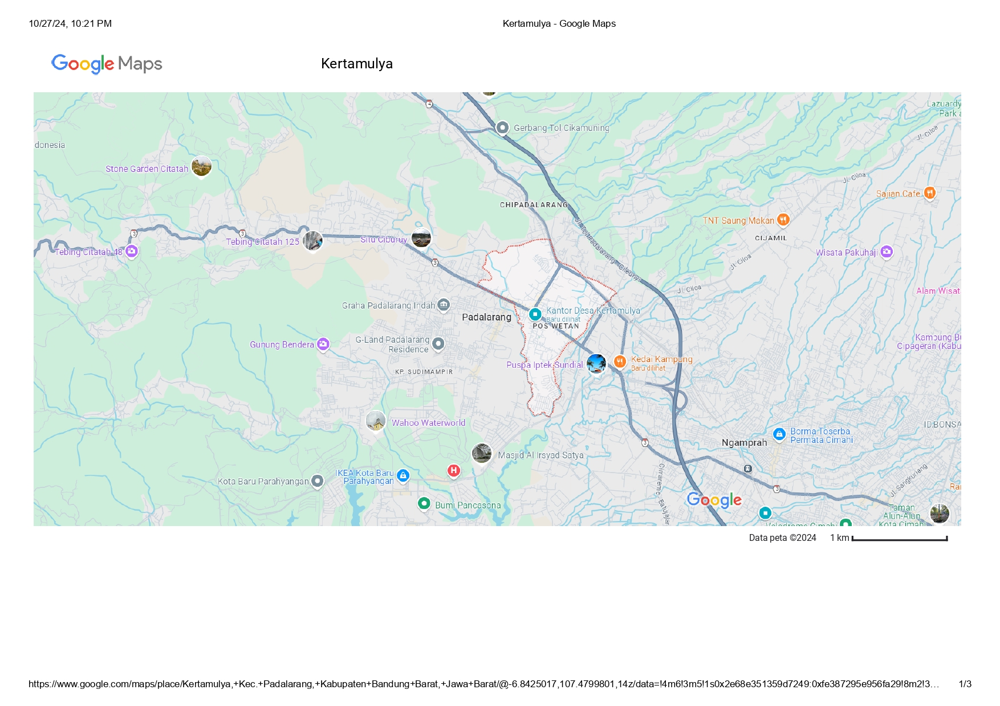

# Smart Quail Cage IoT

## Overview

Smart Quail Cage IoT is an intelligent poultry farming system designed to automate daily cage operations and improve environmental conditions for quail farming. The system integrates temperature and humidity monitoring, ammonia gas detection, automatic feeding, automatic waste cleaning, ventilation control, and cloud-based monitoring using Firebase.

Built around the ESP32 microcontroller, the system supports both manual and automatic operating modes, allowing users to monitor and control the cage remotely through an IoT platform.

## Background

Quail farming is one of the important sources of income for small-scale farmers in rural areas. However, traditional cage management often requires significant manual labor for feeding, waste cleaning, and environmental monitoring. Poor cage conditions can reduce productivity, increase disease risk, and negatively affect animal welfare.

To address these challenges, the Smart Quail Cage IoT system was developed and implemented in Kertamulya Village, Indonesia. The system automates feeding, waste cleaning, ventilation control, and environmental monitoring using IoT technology, helping farmers improve operational efficiency and livestock productivity.

This project was developed as part of an innovation competition focused on sustainable agriculture and rural community empowerment.

## Sustainable Development Goals (SDGs)

This project contributes to several United Nations Sustainable Development Goals (SDGs):

### SDG 1 – No Poverty

By improving farming efficiency and reducing operational costs, the system helps increase productivity and supports the economic welfare of local quail farmers.

### SDG 2 – Zero Hunger

The automation of feeding schedules and environmental control helps maintain livestock health and productivity, contributing to sustainable food production.

### SDG 12 – Responsible Consumption and Production

The system promotes efficient resource utilization through automated farm management, reducing waste and supporting sustainable agricultural practices.

## Implementation Location

The Smart Quail Cage IoT system was implemented and tested in **Kertamulya Village, Indonesia**, as part of a community-based smart farming initiative.

## Features

- Real-time temperature monitoring using DHT22
- Real-time humidity monitoring
- Ammonia gas monitoring using MQ135
- Automatic ventilation control based on ammonia levels
- Automatic feeding system using servo motor
- Automatic waste cleaning system
- RTC-based scheduling with DS3231
- Firebase cloud monitoring and control
- LCD display for local monitoring
- Manual and automatic operation modes
- Physical button controls

## Hardware Components

| Component | Quantity |
|-----------|----------|
| ESP32 DevKit V1 | 1 |
| DHT22 Sensor | 1 |
| MQ135 Gas Sensor | 1 |
| RTC DS3231 | 1 |
| LCD I2C 16x2 | 1 |
| Servo Motor | 1 |
| Relay Module | 2 |
| DC Motor | 1 |
| Push Button | 3 |
| Power Supply | 1 |

## System Architecture

## Pin Configuration

| Device | ESP32 Pin |
|----------|-----------|
| DHT22 | GPIO13 |
| MQ135 | GPIO35 |
| Fan Relay 1 | GPIO25 |
| Fan Relay 2 | GPIO26 |
| Cleaning Motor Relay | GPIO27 |
| Feed Servo | GPIO18 |
| Fan Button | GPIO32 |
| Feed Button | GPIO33 |
| Clean Button | GPIO15 |

## Operating Modes

### Automatic Mode

The system performs automated operations based on sensor readings and scheduled tasks.

#### Ventilation Control

- Fans turn ON when ammonia concentration exceeds 30 ppm.
- Fans turn OFF when ammonia concentration returns below the threshold.

#### Feeding Schedule

- 09:59 AM
- 03:59 PM

#### Cleaning Schedule

- 02:22 PM

### Manual Mode

Users can manually control:

- Ventilation fans
- Feeding mechanism
- Cleaning motor

using either physical buttons or Firebase.

## Community Impact

The implementation of Smart Quail Cage IoT in Kertamulya Village provides several benefits:

- Reduces daily manual workload for farmers.
- Improves feeding consistency through automation.
- Enhances cage hygiene through scheduled cleaning.
- Monitors environmental conditions in real time.
- Supports digital transformation in rural agriculture.
- Encourages sustainable and technology-driven farming practices.
